# FinBot CTF Architecture

## System Architecture Diagram

```mermaid
graph TB
    %% External Users
    Vendor[👤 Vendor User]
    Admin[👤 Admin User]
    
    %% Main UI Block
    subgraph UIs["UIs"]
        %% Frontend Block
        subgraph Frontend["Frontend"]
            VendorFE[Vendor Portal Frontend]
            AdminFE[Admin Portal Frontend]
        end
        
        %% API Backend Block
        subgraph APIBackend["API Backend"]
            VendorBE[Vendor Portal Backend]
            AdminBE[Admin Portal Backend]
            MCPServer[MCP Server TODO]
        end
    end
    
    %% MCP Host
    subgraph MCPHost["MCP Host (TODO)"]
        MCPClient[MCP Client]
    end
    
    %% Supervisor/Orchestrator/Routing Layer
    subgraph SOR["Supervisor/Orchestrator/Routing Layer (partial)"]
        OnboardingAgent[Onboarding Agent]
        InvoiceAgent[Invoice Agent]
        PaymentsAgent[Payments Agent TODO]
        FraudAgent[Fraud/Compliance Agent TODO]
        CommAgent[Communication Agent TODO]
        
        subgraph ToolsConnectors["Tools and Connectors"]
            subgraph ExternalTools["External MCP/Tools (simulated) TODO"]
                GDrive[Google Drive]
                Stripe[Stripe]
            end
            
            subgraph CustomTools["Custom MCP/Tools"]
                Email[Email partial]
                Storage[Storage and Retrieval TODO]
            end
        end
    end
    
    %% CTF Block
    subgraph CTF["CTF (TODO)"]
        CTFPortal[CTF Portal]
        CTFEventStream[CTF Event Stream]
    end
    
    %% Data Layer
    subgraph DataLayer["Data Layer (memories and knowledge bases)"]
        InvoicesDB[(Invoices)]
        VendorsDB[(Vendors)]
        AgentMemoryDB[(Agent Memory TODO)]
        ConfigDB[(Config partial)]
        EmailsDB[(Emails TODO)]
    end
    
    %% User Connections
    Vendor -->|HTTP/HTTPS| VendorFE
    Admin -->|HTTP/HTTPS| AdminFE
    
    %% Frontend to Backend
    VendorFE -->|API Calls| VendorBE
    AdminFE -->|API Calls| AdminBE
    
    %% MCP Communications
    Vendor -->|MCP Protocol| MCPClient
    Admin -->|MCP Protocol| MCPClient
    MCPClient <-->|MCP Protocol| MCPServer
    
    %% UI to SOR
    UIs -->|Route Requests| SOR
    
    %% Agents to Tools
    OnboardingAgent --> ToolsConnectors
    InvoiceAgent --> ToolsConnectors
    PaymentsAgent --> ToolsConnectors
    FraudAgent --> ToolsConnectors
    CommAgent --> ToolsConnectors
    
    %% Persistence Connections
    UIs -->|Persistence| DataLayer
    SOR -->|Persistence| DataLayer
    
    %% CTF Events
    UIs -->|CTF Events| CTFEventStream
    CTFEventStream --> CTFPortal
    
    %% Styling
    classDef userClass fill:#e0f5ff,stroke:#01579b,stroke-width:2px
    classDef frontendClass fill:#fff2e0,stroke:#e65100,stroke-width:2px
    classDef backendClass fill:#f2e5f5,stroke:#4a148c,stroke-width:2px
    classDef mcpClass fill:#e7f5e9,stroke:#1b5e20,stroke-width:2px
    classDef ctfClass fill:#fce3ec,stroke:#880e4f,stroke-width:2px
    classDef agentClass fill:#e8eaf6,stroke:#283593,stroke-width:2px
    classDef toolClass fill:#fff9c4,stroke:#f57f17,stroke-width:2px
    classDef dataClass fill:#e0f2f1,stroke:#004d40,stroke-width:2px
    
    class Vendor,Admin userClass
    class VendorFE,AdminFE frontendClass
    class VendorBE,AdminBE,MCPServer backendClass
    class MCPClient,MCPHost mcpClass
    class CTFPortal,CTFEventStream,CTF ctfClass
    class OnboardingAgent,InvoiceAgent,PaymentsAgent,FraudAgent,CommAgent agentClass
    class GDrive,Stripe,Email,Storage toolClass
    class InvoicesDB,VendorsDB,AgentMemoryDB,ConfigDB,EmailsDB dataClass
```

## Components

### External Users
- **Vendor User**: Accesses the vendor portal to manage invoices, view dashboards, and interact with AI agents
- **Admin User**: Accesses the admin portal for system administration and monitoring

### Frontend Layer
- **Vendor Portal Frontend**: Web interface for vendor users
  - Invoice management UI
  - Dashboard views
  - Chat interface with agents
- **Admin Portal Frontend**: Web interface for administrators
  - System monitoring
  - User management
  - Configuration

### API Backend Layer
- **Vendor Portal Backend**: Business logic and API endpoints for vendor operations
- **Admin Portal Backend**: Admin-specific API endpoints and logic
- **MCP Server**: Model Context Protocol server for AI agent interactions

### MCP Host
- **MCP Client**: Intermediary that routes MCP protocol requests between users and the MCP Server
  - Handles authentication
  - Request routing
  - Protocol translation

### Supervisor/Orchestrator/Routing Layer (SOR)
The intelligent routing and coordination layer that manages AI agents and their interactions.

#### Agents
- **Onboarding Agent**: Handles new vendor onboarding workflows
  - Account setup
  - Document collection
  - Initial configuration
  
- **Invoice Agent**: Manages invoice processing and inquiries
  - Invoice upload and parsing
  - Status tracking
  - Payment reconciliation
  
- **Payments Agent**: Handles payment-related operations
  - Payment processing
  - Transaction status
  - Payment history queries
  
- **Fraud/Compliance Agent**: Monitors for fraud and ensures compliance
  - Transaction monitoring
  - Risk assessment
  - Compliance checks
  - Anomaly detection
  
- **Communication Agent**: Manages all communication needs
  - Email notifications
  - Status updates
  - Document delivery

#### Tools and Connectors
**External MCP/Tools (simulated)**:
- **Google Drive**: Document storage and retrieval simulation
- **Stripe**: Payment processing simulation

**Custom MCP/Tools**:
- **Email**: Email sending and templating
- **Storage and Retrieval**: Internal document management and data access

### Data Layer (memories and knowledge bases)
Persistent storage for all system data, agent memories, and configurations.

- **Invoices**: Invoice records, status, and transaction history
- **Vendors**: Vendor profiles, contact information, and business details
- **Agent Memory**: Conversation history, context, and learned preferences
- **Config**: System configuration, feature flags, and settings
- **Emails**: Email templates, sent messages, and communication logs

### CTF (Capture The Flag)
- **CTF Portal**: Interface for viewing CTF challenges, scores, and leaderboards
- **CTF Event Stream**: Event bus that captures user interactions and system events
  - Tracks security challenges
  - Records event sequences
  - Feeds data to scoring engine

## DaData Persistence**: Both UI and SOR layers persist data to the Data Layer
   - UIs store user data, invoices, and vendor information
   - SOR stores agent memories, conversation context, and learned patterns
7. **MCP Protocol**: Users and MCP Client communicate using MCP protocol for AI interactions
8. **CTF Event Capture**: All UI interactions generate events sent to the CTF Event Stream
9. **User Interaction**: Users interact with their respective portals via HTTP/HTTPS
2. **Frontend to Backend**: Frontends make API calls to their corresponding backends
3. **Request Routing**: UI layer routes requests to the Supervisor/Orchestrator/Routing Layer
4. **Agent Selection**: SOR selects appropriate agent(s) based on request type
5. **Tool Invocation**: Agents use tools and connectors to perform operations
   - External tools (Google Drive, Stripe) for third-party integrations
   - Custom tools (Email, Storage) for internal operations
6. **MCP Protocol**: Users and MCP Client communicate using MCP protocol for AI interactions
7. **CTF Event Capture**: All UI interactions generate events sent to the CTF Event Stream
8. **Event Processing**: CTF Event Stream feeds data to CTF Portal for scoring and challenge tracking

## Technology Stack (Planned)

- **Frontend**: HTML/CSS/JavaScript (current), React/Vue (future consideration)
- **Backend**: Python/FastAPI
- **MCP**: Model Context Protocol for AI agent communication
- **Event Stream**: Redis Streams
- **Database**: PostgreSQL (production), SQLite (development)
- **Containerization**: Docker Compose

## Future Expansion

This architecture will be expanded to include:
- Agent orchestration layer
- Multi-agent coordination
- Additional MCP servers
- Scoring engine details
- Database layer
- External service integrations (email, storage)
